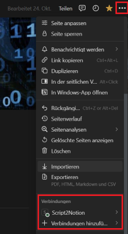

# Tool: Script2Notion

## Summary

This tool can be used to publish a lecture script as a lecture notes page to my Notion workspace. The tool takes a PDF file as input and publishes the content to a Notion page with the same name as the file name. The content of the lecture script is parsed page wise, by generating an image for each page and extracting some basic information. The content is then uploaded to Notion using the Notion API.

## Prerequisites

### Libraries

**Python** 

- `requests`: Version 2.31.0
- `pdf2image`: Version 1.16.3
  
**Windows**

- `Poppler`: Version 23.11.0 (Library needed by `pdf2image`)

### Notion API Token (Integration)

In order for the script to work we need a token for the use of the Notion API. 

Your Notion API tokens are managed using Notion integrations. You can create a new integration on this [website](https://www.notion.so/my-integrations).

When created we have to allow the integration in our Notion workspace. This can be done in the Notion workspace menu as shown below.

The Notion token of the newly created integration can be specified for the script via command line argument or as the environment variable `NOTION_TOKEN`.